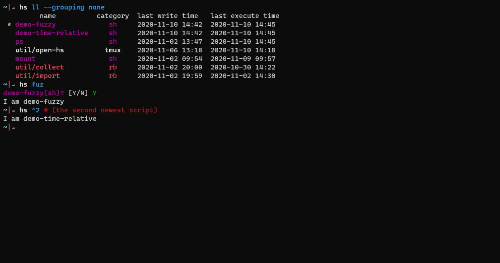

_The (over-killing) script managing tool for script lovers._

[](https://asciinema.org/a/431499)

# Install

```sh
caargo install hyper-scripter
```

# Quick start
```bash
hs edit # edit whatever you want in editor
hs -    # run the newest script, and voila!
```

# Key features
## Manage your scripts globally
## Find your scripts with fewer keystrokes
`hs` supports two ways of finding scripts: __fuzzy search__ and __time relative search__.


## Organize your scripts by tags and namespaces
## Tracable

# How to use
```bash
USAGE:
    hyper-scripter [FLAGS] [OPTIONS] [SUBCOMMAND]

FLAGS:
    -a, --all         Shorthand for `-f=all,^remove`
    -h, --help        Prints help information
        --no-alias
        --timeless    Show scripts of all time.
    -V, --version     Prints version information

OPTIONS:
    -f, --filter <filter>      Filter by tags, e.g. `all,^mytag`
    -H, --hs-home <hs-home>    Path to hyper script home
        --recent <recent>      Show scripts within recent days.

SUBCOMMANDS:
    alias    Manage alias
    cat      Print the script to standard output
    cp       Copy the script to another one
    edit     Edit hyper script
    help     Prints this message, the help of the given subcommand(s), or a script's help message.
    ls       List hyper scripts
    mv       Move the script to another one
    rm       Remove the script
    run      Run the script
    tags     Manage script tags. If a tag filter is given, set it as default, otherwise show tag information.
    which    Execute the script query and get the exact file
```

# Customizing hyper scripter
You can find the config file at `~/.config/hyper_scripter/.config.toml`. Here's an example:
```toml
# Filter out scripts within recent days.
recent = 999999

# Alias you may find handy
[alias.la]
after = ['ls', '-a']
[alias.gc]
after = ['rm', '-f', 'remove', '*']

# ...
# Type and tag filters will be discussed later
```

## Type and templates
You can add your own script Type here. For example, you may want to run ruby scripts with `irb`, rather than simply `ruby`. Here's how you can achieve that:
```toml
# Type and templates
[categories.irb]
ext = 'rb' # file extensions is same as any ruby scripts.
color = 'bright red' # colors shown in `hs ls` and other places.
# tmplate is powred by handlebars
template = [
    '# Hello, scripter!',
    '''Dir.chdir("#{ENV['HOME']}/{{birthplace_rel}}")''',
    "NAME = '{{name}}'",
    '',
    'def {{name}}',
    '    {{#each content}}{{{this}}}',
    '    {{/each}} ',
    'end'
]
# the exact program you want to run scripts with
cmd = 'irb'
# arguments are also templates
args = ['-r', '{{path}}']
# environment variables
env = []
```

# Advanced topics
## tag filters
## script query
> ### bang!
## list query
